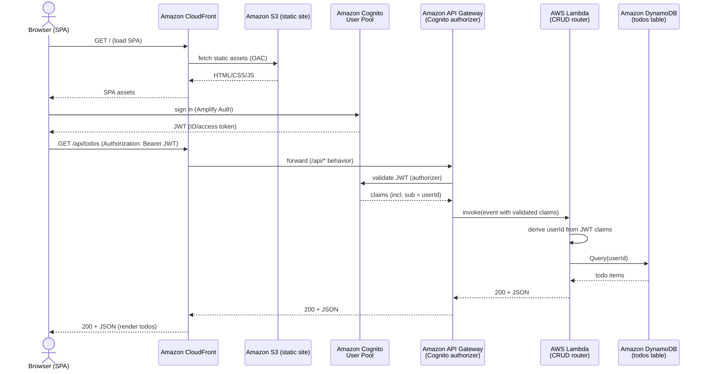
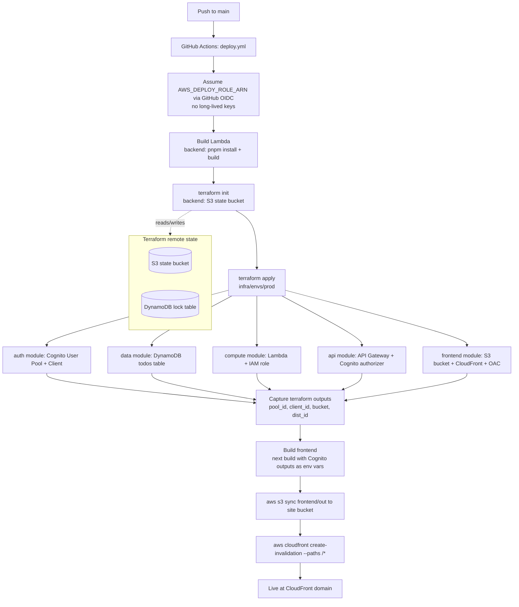

# Architecture

This app follows the AWS Well-Architected Serverless Applications Lens
["Web application" reference architecture](https://docs.aws.amazon.com/wellarchitected/latest/serverless-applications-lens/web-application.html)
exactly. This doc focuses on diagrams of the runtime request flow and the deploy
workflow, as built in `infra/` and `.github/workflows/`.

> **Reference:** https://docs.aws.amazon.com/wellarchitected/latest/serverless-applications-lens/web-application.html

## AWS services in use

| Service | Role | Where it's provisioned |
|---|---|---|
| Amazon Cognito (User Pool + App Client) | Auth / identity provider, issues JWTs | `infra/modules/auth` |
| Amazon CloudFront | Single public entry point; default behavior → S3, `/api/*` behavior → API Gateway | `infra/modules/frontend` |
| Amazon S3 (site bucket) | Hosts the Next.js static export, private + Origin Access Control | `infra/modules/frontend` |
| Amazon API Gateway (REST) | HTTPS endpoint, Cognito authorizer on all `/todos` routes | `infra/modules/api` |
| AWS Lambda | Single function, internal router for CRUD | `infra/modules/compute` |
| Amazon DynamoDB (`todos` table) | Data store, `userId` (PK) + `todoId` (SK) | `infra/modules/data` |
| Amazon CloudWatch Logs | Lambda execution logs (`AWSLambdaBasicExecutionRole`) | `infra/modules/compute` |
| AWS IAM | Lambda execution role scoped to the `todos` table; GitHub OIDC deploy/plan roles | `infra/modules/compute`, account-level (referenced, not provisioned here) |
| Amazon S3 + DynamoDB (Terraform backend) | Remote state storage + lock table | `infra/bootstrap` |
| GitHub Actions (OIDC, not AWS but part of the deploy path) | CI/CD, assumes AWS roles with no long-lived keys | `.github/workflows/ci.yml`, `deploy.yml` |

## Runtime sequence — sign-in and CRUD request

Covers both the auth handshake and a representative CRUD call (`GET /todos`);
create/update/delete follow the same Lambda → DynamoDB shape.

## Deploy workflow — push to `main`

`ci.yml` runs the same lint/test/`terraform plan` steps read-only on every PR
via a separate, plan-only OIDC role; the diagram below is the `deploy.yml`
path that actually changes infrastructure and ships the app.

## Notes

- The Terraform state backend (S3 bucket + DynamoDB lock table) is bootstrapped
  once, manually, via `infra/bootstrap` — it is not part of the `deploy.yml`
  pipeline (chicken-and-egg: the pipeline needs remote state to already exist).
- The GitHub OIDC deploy/plan IAM roles themselves are account-level and are
  referenced by ARN (`AWS_DEPLOY_ROLE_ARN`, `AWS_PLAN_ROLE_ARN` repo secrets),
  not provisioned by this repo's Terraform.
- CloudFront's `/api/*` behavior means the SPA calls same-origin `/api/...`
  URLs — there is no CORS configuration anywhere in this stack.
