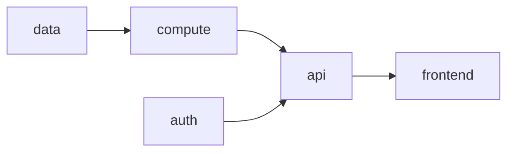

# Infra

Terraform for the entire [AWS reference architecture](../README.md): Cognito,
CloudFront, S3, API Gateway, Lambda, and DynamoDB, plus the remote state
backend that everything else depends on.

## Layout

```
bootstrap/    # One-time: S3 state bucket + DynamoDB lock table
envs/prod/    # Root module — the only environment; wires the modules below
modules/
├── auth/       # Cognito User Pool + App Client
├── data/       # DynamoDB todos table (userId PK, todoId SK)
├── compute/    # Lambda function + IAM execution role
├── api/        # API Gateway REST API + Cognito authorizer
└── frontend/   # S3 site bucket + CloudFront (default → S3, /api/* → API GW)
```

Modules communicate only through inputs/outputs — no data sources reaching
across module boundaries. `envs/prod/main.tf` is the only place that wires
them together (see below).



## `infra/bootstrap` — apply this first, manually

Terraform needs a remote state backend to exist before `envs/prod` can run
`terraform init`. `bootstrap` creates that backend (an S3 bucket + a DynamoDB
lock table) and is **not** part of `deploy.yml` — it's a one-time, by-hand step:

```bash
cd infra/bootstrap
terraform init
terraform apply \
  -var="region=<YOUR_AWS_REGION>" \
  -var="state_bucket_name=<globally-unique-bucket-name>"
```

> [!WARNING]
> Re-running `terraform destroy` here deletes the state bucket and lock table
> for every environment that uses them. Only do this after tearing down
> `envs/prod` first — see the [root README](../README.md#6-tear-down-avoid-ongoing-charges).

## `infra/envs/prod` — the application stack

The single environment (no dev/staging split). `backend.tf` points at an S3
backend whose `bucket`/`region`/`dynamodb_table` are supplied at `terraform
init` time via `-backend-config`, not hardcoded, so a fork can bootstrap its
own state without editing this file.

```bash
cd infra/envs/prod
terraform init \
  -backend-config="bucket=<STATE_BUCKET_NAME>" \
  -backend-config="region=<AWS_REGION>" \
  -backend-config="dynamodb_table=<LOCK_TABLE_NAME>"
terraform plan \
  -var="region=<AWS_REGION>" \
  -var="site_bucket_name=<globally-unique-bucket-name>"
```

Copy `terraform.tfvars.example` to `terraform.tfvars` to avoid retyping `-var`
flags for local plans.

**Inputs** (`variables.tf`):

| Variable | Required | Notes |
|---|---|---|
| `region` | yes | AWS region for every resource in the stack |
| `site_bucket_name` | yes | Globally-unique S3 bucket for the frontend |
| `name_prefix` | no (default `todo-prod`) | Prefixes resource names (table, function, Cognito, etc.) |

**Outputs** (`outputs.tf`) — consumed by `deploy.yml` to build/ship the
frontend after `apply`:

| Output | Used for |
|---|---|
| `user_pool_id`, `user_pool_client_id` | `NEXT_PUBLIC_*` env vars for `next build` |
| `site_bucket_name` | `aws s3 sync` target |
| `distribution_id` | `aws cloudfront create-invalidation` target |
| `distribution_domain` | The live app URL |

The Lambda deployment package is built here too: `data.archive_file.lambda`
zips `backend/dist/index.js` (built by `pnpm run build` in `backend/`) before
`module.compute` creates the function from it.

## Modules

| Module | Creates | Key inputs |
|---|---|---|
| `auth` | Cognito User Pool + App Client | `name_prefix` |
| `data` | DynamoDB table, `userId` PK / `todoId` SK, on-demand billing | `table_name` |
| `compute` | Lambda function + execution role scoped to the table | `table_name`, `table_arn`, `lambda_zip_path` |
| `api` | API Gateway REST API, Cognito authorizer, Lambda integration | `user_pool_arn`, `lambda_invoke_arn` |
| `frontend` | S3 site bucket (private, OAC) + CloudFront (default → S3, `/api/*` → API GW) | `bucket_name`, `api_invoke_domain`, `api_stage_name` |

## Conventions

- `terraform fmt -check`, `terraform validate`, and `terraform plan` gate every
  pull request in `ci.yml`, using a read-only, plan-scoped OIDC role.
- `terraform apply` only ever runs from `deploy.yml` on push to `main`, using a
  separate deploy-scoped OIDC role — there are no long-lived AWS credentials
  anywhere in this repo.
- Neither S3 bucket this stack creates (`site`, state) has `force_destroy`
  enabled; empty them before `terraform destroy`. See the [root README's
  teardown steps](../README.md#6-tear-down-avoid-ongoing-charges).

See [`docs/architecture.md`](../docs/architecture.md) for the full deploy
sequence diagram and the AWS-services-to-module mapping.
